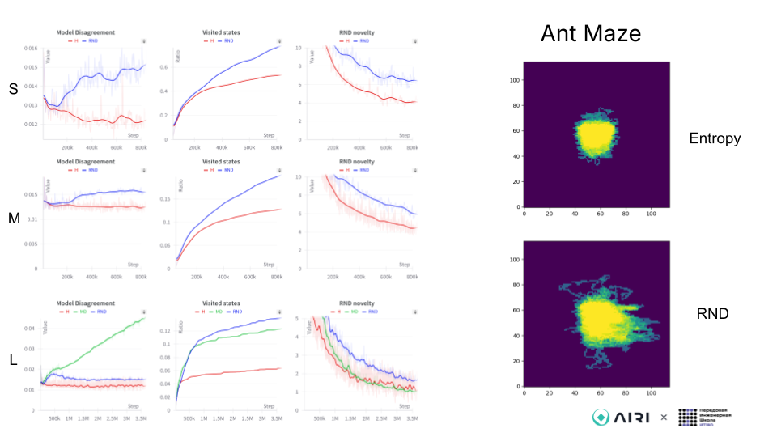

# №43: Exploration Metrics for RL agents.

Авторы: ***Нестерова Мария** (ФИЦ ИУ РАН, аспирант МФТИ), **Загайнов Никита** (Innopolis University), **Манжос Геннадий** (Приволжский исследовательский медицинский университет, аспирант университета ИТМО)*

##

В контексте глубокого обучения с подкреплением (Reinforcement Learning, RL) для решения некоторых задач агенту важно тщательно исследовать среду. Существует множество известных методов для выполнения этой задачи, однако чаще всего сравнение между ними проводится только на основе получаемой награды. Мы предполагаем, что более полезным будет сравнение алгоритмов по степени исследования агентом среды. Сложность заключается в отсутствии единого подхода к количественной оценке исследования для сред с непрерывным пространством состояний или с наблюдениями в виде изображения.

**Цель:** определить несколько метрик для оценки качества исследования агентом среды.

**Задачи:**
- Провести поиск существующих метрик.
- Протестировать метрики на наборе базовых алгоритмов (PPO, SAC и тп) в т.ч. исследования (eps-greedy, entropy, RND, etc), определить зависимость успешности агента от его исследовательских характеристик.
- Определить для метрик их преимущества и недостатки, обозначить область применимости.

## Методы
<!-- Было выдвинуто предположение, что существующие методы исследования, такие как **RND, Model Disagreement as intrinsic reward, Entropy**, плохо работают при масштабировании среды агента или полной её замены. Для проведения экспериментов, мы использовали метрики: -->

Как базовую метрику, с которой можно сравниваться, была выбрана метрика **State Counting** (подсчет посещенных состояний).
Дополнительно, было выдвинуто предположение, что метрикой может выступать оценка новизны нового состояния в методах исследования, таких как **RND, Model Disagreement**. С другой стороны, мы предположили, что наиболее общей метрикой буде та, которая способна построить свою оценку на наборе истории состояний после обучения агента. Похожий подход был представлен в статье **Offline Measures for Exploration**. Ниже рассмотрены описанные выше метрики.

**State Counting** - это когда мы считаем общее кол-во посещенных агентом клеток в заданной среде и строим частоту посещений определенных клеток в виде тепловой карты.

 https://www.sciencedirect.com/science/article/pii/S1566253522000288?via%3Dihub#b14

**RND** - это когда агент получает внутреннюю мотивацию **(intrinsic reward)** за ход, приближающий его ближе к вознаграждению 

 [https://arxiv.org/pdf/1810.12894](https://arxiv.org/pdf/1810.12894)

**Model Disagreement** - это когда агент получает внутреннюю мотивацию **(intrinsic reward)** за ход, приближающий его ближе к вознаграждению 

[https://pathak22.github.io/exploration-by-disagreement/resources/icml19.pdf](https://pathak22.github.io/exploration-by-disagreement/resources/icml19.pdf)

**Offline Measures for Exploration** - это офлайн-оценка того, насколько близко распределение собранных состояний к равномерному распределению.

[https://arxiv.org/pdf/2010.15533](https://arxiv.org/pdf/2010.15533)

## Разработка

Для обучения агента был использован метод **PPO**. Мы использовали фреймворк **cleanRL** (https://docs.cleanrl.dev/) для создания основного пайплайна быстрой воспроизводимости результатов эксперимента, **tensorboard** (https://www.tensorflow.org/tensorboard) и **wandb** (https://wandb.ai/site) для трекинга графиков экспериментов. 
Все метрики были реализованы нами, на основе информации и статей.

### Среды
В данной работе мы исследовали существующие метрики для различных популярных сред в обучении с подкреплением, используя фреймворк gymnasium для выбора сред, таких как **PointMaze, AntMaze, MontezumaRevenge** (https://robotics.farama.org/envs/maze/, https://gymnasium.farama.org/environments/atari/montezuma_revenge/). 

Для создания пайплайна всех экспериментов, мы использовали код алгоритма **PPO**, дополнив в нём соответствующие параметры запуска сред с нужными нам флагами: выбор нужной среды (pointmaze, antmaze, montezuma revenge), выбор размера карт с параметрами small (7x10) | medium (15x15) | large (25x25). 

Таким образом, были созданы кастомные карты сред-лабиринтов в виде матриц, с явно заданными целями **"g" (goal)** и **"r" (agent)**. 

Отметим, что среды PointMaze и AntMaze были выбраны так как в них легко внедрить метрику подсчета состояний (State Counting). Среда montezuma revenge является классической для проверки методов нацеленных на исследование среды.

#### PointMaze

#### AntMaze

#### MontezumaRevenge

## Эксперименты

Все скрипты для запуска обучения агента перечислены в [README](README.md).

Сперва мы запустили пайплайн со средой **PointMaze**, получив следующие результаты:

Затем, мы запустили тот же пайплайн со средой **AntMaze**, получив следующие результаты:

В конце, мы запустили тот же пайплайн со средой **MontezumaRevenge**, получив следующие результаты:

В последние минуты мы запустили оффлайн-тестирование метрики на основе распределений на большой карте **PointMaze**. 

Мы представили три графика с разной настройкой параметров метрики. Результаты:

Эта метрика имеет схожее поведение с State Counting, она возрастает со временем, что соответствует исследованию агентом пространства со временем. Однако для этой среды по метрике State Counting лучше всего себя показывает метод со внутренней наградой RND, а по оффлайн метрике этот метод показал самый низкий результат при любом способе подсчета.

## Результаты

По итогам проведенной работы, можно сказать о том, что описанные здесь подходы при выборе разных сред показывают что подходы, основанные на оценке новизны, иногда обеспечивают достойную оценку исследования агента RL, но они недостаточно подтверждены, чтобы обобщить этот ответ на все среды и алгоритмы.
